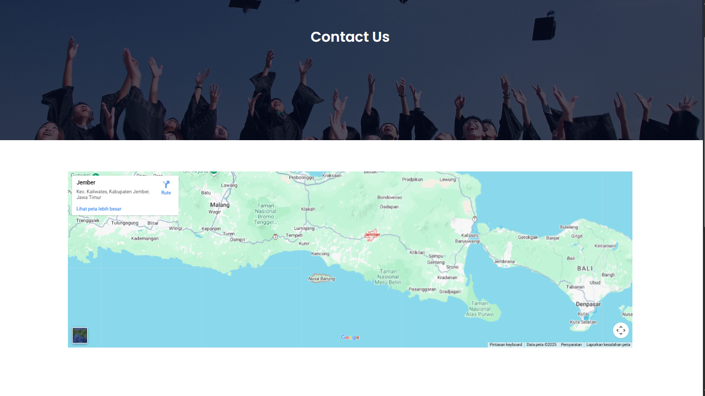

# EduFord - University Website Template

## Overview

EduFord is a modern, responsive university website template built with HTML, CSS, JavaScript, and PHP. It's designed for educational institutions looking to establish an online presence with a professional and clean interface.

This template is perfect for universities, colleges, schools, and other educational organizations that want to showcase their programs, facilities, and campus life to prospective students and visitors.

## Screenshots

| Page | Screenshot |
|------|------------|
| Home |  |
| About |  |
| Courses |  |
| Blog |  |
| Contact |  |


## Website Structure

The website consists of five main pages, each serving a specific purpose:

| Page | File | Description |
|------|------|-------------|
| Home | `index.html` | The main landing page featuring a hero section with a call-to-action, course overview, campus facilities showcase, and student testimonials |
| About | `about.html` | Detailed information about the university, including campus facilities (library, cafeteria, basketball court) and key statistics |
| Courses | `course.html` | A showcase of academic programs and courses offered by the institution |
| Blog | `blog.html` | News, updates, articles, and stories from the university community |
| Contact | `contact.html` | A contact form for inquiries along with location and reach information |

## Key Features

- **Responsive Design**: The website is fully mobile-friendly and adapts to different screen sizes, featuring a hamburger menu for mobile navigation
- **Modern UI**: Clean and professional design using Google Fonts (Poppins) for typography and Font Awesome icons for visual elements
- **Interactive Elements**: JavaScript-powered mobile menu toggle for seamless navigation on smaller devices
- **Visual Sections**: Includes a hero banner with background image, course offerings displayed in cards, campus facilities showcase with icons, student testimonials, and a functional contact form
- **CSS Flexbox Layouts**: Modern CSS techniques for flexible and maintainable page layouts

## Technology Stack

- **Frontend**: HTML5, CSS3, JavaScript
- **Backend**: PHP (for contact form handling)
- **External Resources**:
  - Google Fonts - Poppins (https://fonts.googleapis.com/css2?family=Poppins:wght@100;200;300;400;600;700&display=swap)
  - Font Awesome 6.4 (https://cdn.jsdelivr.net/npm/@fortawesome/fontawesome-free@6.4.2/css/all.min.css)

## Project Structure

```
eduford/
├── index.html          # Home page
├── about.html          # About page
├── course.html         # Courses page
├── blog.html           # Blog page
├── contact.html        # Contact page
├── style.css           # Main stylesheet
├── form-handler.php    # Contact form processor
└── images/             # All images and assets
    ├── logo.png
    ├── banner.png
    ├── banner2.jpg
    ├── background.jpg
    ├── about.jpg
    ├── library.png
    ├── cafeteria.png
    ├── basketball.png
    ├── certificate.jpg
    ├── user1.jpg
    ├── user2.jpg
    ├── london.png
    ├── newyork.png
    └── washington.png
```

## How to Use

1. **View the Website**: Open `index.html` in any web browser to view the website
2. **Customize Content**: Edit the HTML files to update text, images, and links to match your institution
3. **Modify Styling**: Adjust colors, fonts, spacing, and other visual elements in `style.css`
4. **Configure Contact Form**: Update `form-handler.php` to handle form submissions (e.g., send emails or store in database)

## Credits

This template was created based on the Easy Tutorials YouTube channel's university website design tutorial. It's a great starting point for learning web development fundamentals including:

- HTML structure and semantics
- CSS styling and responsive design
- JavaScript interactivity
- Basic PHP form handling
- CSS flexbox layouts

## License

This is a free template for educational purposes. Feel free to use, modify, and distribute as needed.

---

Built with ❤️ for education
